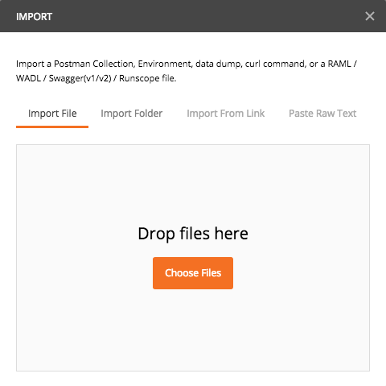
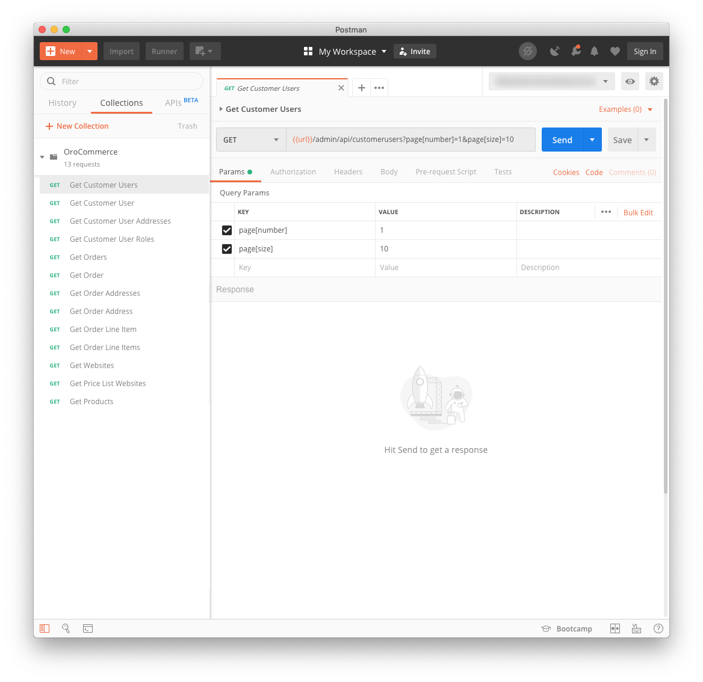
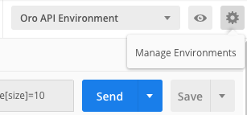

# Postman Collection for Oro products

[Postman](https://www.getpostman.com/) is a powerful tool which helps to communicate with the API of many applications or just do HTTP requests for development purposes. We use it for our projects like Magento, [Akeneo](https://github.com/akeneo/pim-api-docs/tree/master/content/files) and of course Oro that we will introduce here.

A postman collection is a set of methods which can be used to call the Oro API. Instead to write down everything on your own, we create a collection that we are happy to share here.

Feel free to fork it and enhance this collection by sending us a Pull Request

You will find in this repository a collection to work with the API of Oro products:

- Orocommerce 3.x (4.x is in prorgess on our side): some methods currently but is regurlaly improved. See the list below.
- OroCRM: coming soon
- OroPlatform: coming soon

## How to ?

### Install Postman if not already installed

Download the Postman application (which is free by the way) from their official [website.](https://www.getpostman.com/apps). If you do not wish to download an application, there is a Chrome extension also available (on the same [website](https://www.getpostman.com/apps)).

### Import the collection and the environment template into Postman

Download the following files:

- [oro.postman_environment.json](oro.postman_environment.json) 
- [orocommerce.postman_collection.json](orocommerce/orocommerce.postman_collection.json)

In Postman, click the `Import` button and drop the two files you just downloaded in the pop-in that should look like this.

As a result, you will see a new collection in the `Collection` tab, on the left side of your screen.

### Setup your environment

Click on the gear wheel in the top right corner, and then select `Manage environments`.

In the following pop-in select the environment called `Oro API environment`.

Then change the value of the following keys:

- `url` with the url where your Oro product is hosted,
- `userkey` with your user key that has been generated for this Oro product, Go to your 
- `username` with your Oro username,
- `userpass` with your Oro password.

Do not forget to save your changes by clicking the `Update` button.

## OroCommerce collection

- Get Customer Users
- Get Customer User
- Get Customer User Addresses
- Get Customer User Roles
- Get Orders
- Get Order Addresses
- Get Order Address
- Get Order Line Item
- Get Order Line Items
- Get Websites
- Get / Delete Price List Websites
- Get Products

## License

[Do What The Fuck You Want To Public License (WTFPL)](http://www.wtfpl.net/)

## Author

* Sylvain Rayé
* http://www.diglin.com/
* [@diglin_](https://twitter.com/diglin_)
* [Follow me on github!](https://github.com/diglin)
